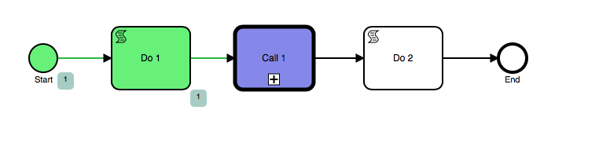
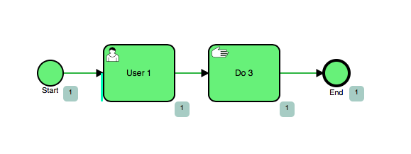
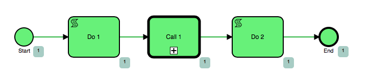
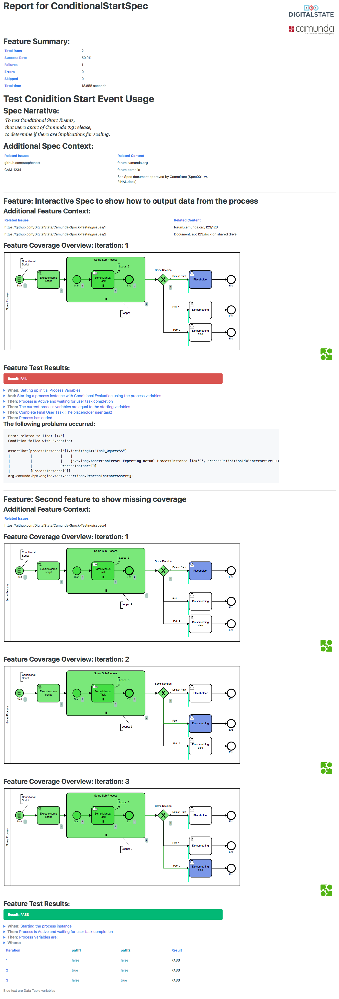

# Camunda Coverage Generation

A Unit testing tool for generating Camunda BPMN Coverage diagrams using BPMN.js

The tool uses Groovy and the Camunda Assertion framework.

# How it works

The coverage generation helpers provide easy to use methods to take
"Coverage Snapshots" at any point during a unit test.

Each snapshot generates "Coverage Data" which is used to generate HTML
files in the build target folder.

The HTML files have all the required data injected into them and are self-contained.
Each .html file uses the bpmnjs renderer loaded through CDN.

## Example output

Initial Parent Process:



Call 1 Sub Process:



Finished Parent Process:




Green = Completed

Blue = Unfinished/Still Active

Grey Box with Number = Occurrence Count (Used to show where activity's have looped/executed multiple times.

## Spock Framework Report Example:




## Notes

1. Groovy is required to use these helpers for generating coverage reports
1. Camunda History logging should be set to "Full".  The Camunda History service is used to query the Camunda DB for the various data needed to generate coverage.


# Coverage

The following coverage items are currently covered by this tool:

| Coverage Item | Notes         |
| ------------- | ------------- |
| Finished Activity Instances | Shows which activities were successfully executed and completed. |
| Unfinished Activity Instances | Shows which activities remained active; this means the activities were started, but did not complete, and did not throw a error |
| Finished Sequence Flows | Shows sequence flow completion, allowing tracking of specific sequence flow pathways |
| BPMN Model Async Flag: Before/After Async, Exclusive | Shows which activities have a Async Before, Async After, and Exclusive configuration in the BPMN Model |
| User Tasks Async Flag | Shows a marker for each User Task to indicate the User Tasks async nature; this is a different marker than the BPMN Model Async Flag |
| External Task Async Flag | Shows a marker for each Service Task with a 'External' implementation, to indicate the Service Task's async nature; this is a different marker than the BPMN Model Async Flag |
| Receive Task Async Flag | Shows a marker for each Receive Task, to indicate the Task's async nature; this is a different marker than the BPMN Model Async Flag |
| Intermediate Catch Events Async Flag | Shows a marker for each Intermediate Catch Event. to indicate the event's async nature; this is different than the BPMN Model Async Flag |
| Variable instance activity | Shows a icon where activities have created, modified, or deleted a Variable during execution |
| Activity Occurrence/Instance Counts | Shows Counts under each executed activity to show the number of times a activity was executed.  Typically used to visualize loops and multi-instance scenarios within a BPMN. |

Each coverage item can have its look-and-feel modified through a change in the rendering templates: head.html, body.html, and footer.html.

# Usage

| Method     | Usage       | Notes      |
| ---------- | ----------- | -----------|
|`getSequenceFlowFileName()` | Returns the file name defined in the path to the SequneceFlowListener javascript file. | Expects that the javascript file will be located within at least 1 folder.  See the Spock Framework Example. |
|`getSequenceFlowListenerScript()` | Returns a InputStream of the Listener Script that can then be added into the deployment.  See the Spock Framework example.  | |
|`addSequenceFlowListeners('some/path/to/file.bpmn')` | Processes a BPMN file to add Listeners to each sequence flow, and returns a Model Instance to be used in the deployment | See the Spock Framework Example. |
|`coverageSnapshot(processInstance, 'Coverage Title')` | Generates a coverage snapshot: this will query the Process Instance's BPMN Model and the Camunda DB for all relevant data required to generate the Coverage Data.  This method can be called multiple times during a test, allow coverage generation throughout the process lifecycle. | Only the process instance is required.  The Title is optional and only used to set a custom file name of the .html file generated by `saveCoverageSnapshots()` |
|`saveCoverageSnapshots()` | Generates BPMN.js .html coverage files for each Coverage Snapshot.  Saves to the defined output directory; typically: `target/bpmn-converage/[fully.qualified.class.name]/`. | The snapshots will be saved in the order they were generated with file names formats of: If coverageName was provided: `[index]_[coverageName].html` or if no coverage name was provided: `[index].html`.  Examples: 0_snap.html, 1_anotherSnap.html, 2.html.  Notice how you can use titles and no-titles as you see fit.  See the Spock Framework Example.|


The coverage generation tool using Groovy Traits to inject the functions.  Within your Groovy class of your Unit Test add the following traits `CoverageBuilder` and `SequenceFlowHistory`

Such as:

```groovy
import io.digitalstate.camunda.coverage.bpmn.CoverageBuilder
import io.digitalstate.camunda.coverage.bpmn.SequenceFlowHistory

CallActivitySingleFeatureSpec extends Specification implements CoverageBuilder, SequenceFlowHistory{
...

}

```

# Offline Usage (BPMN.js CDN vs Local bpmn.js file)

By default the bpmn.js library from [bpmn.io](http://bpmn.io) is loaded from a CDN.  This is done for easy compartmentalization 
and 'no worry' setup.  But in some environments this may not be optimal:

For build/test environment that do not have access to the internet, a local bpmn.js is provided.

When using the `saveCoverageSnapshots()` method you can provide a boolean value to override the default/globally set CDN configuration. 
By default the CDN is used.  If you use `saveCoverageSnapshots(false)`, this will instruct the coverage builder to use the local bpmn.js file, 
and it will save that file into `${buildDir}/bpmn-coverage/bpmnjs/[bpmnjsFile]`, typically this means something like: `target/bpmn-coverage/bpmnjs/bpmn-navigated-viewer.development-2.1.0.js`.

See the TemplateGeneration.groovy file for further methods on how to override the location of the CDN URL and the local bpmnjs file.

# How to install

Add JitPack as a repository source in your build file.

If you are using Maven, then add the following to your pom.xml

```xml
<project>
...
    <repositories>
        <repository>
            <id>jitpack.io</id>
            <url>https://jitpack.io</url>
        </repository>
    </repositories>
...
```

This snippet will enable Maven dependency download directly from Github.com

Then add the following dependency:

```xml
...
 <dependency>
    <groupId>com.github.digitalstate</groupId>
    <artifactId>camunda-coverage-generation-groovy</artifactId>
    <version>v0.8</version>
    <scope>test</scope>
 </dependency>
```


# Usage example with Spock Framework

```groovy
class CallActivitySingleFeatureSpec extends Specification implements CoverageBuilder, SequenceFlowHistory {

    @ClassRule
    @Shared ProcessEngineRule processEngineRule = new ProcessEngineRule('camunda_config/camunda.cfg.xml')
    @Shared String deploymentId

    def setupSpec(){
        def deployment = repositoryService().createDeployment()
                .addInputStream(getSequenceFlowFileName(), getSequenceFlowListenerScript())
                .addModelInstance('CallActivityCoverage.bpmn', addSequenceFlowListeners('bpmn/CallActivityCoverage.bpmn'))
                .addModelInstance('CallActivityCoverage2.bpmn', addSequenceFlowListeners('bpmn/CallActivityCoverage2.bpmn'))
                .name('CallActivitiesCoverage')
                .enableDuplicateFiltering(false)
                .deploy()
        deploymentId = deployment.getId()
        println "Deployment ID: '${deploymentId}' has been created"
    }

    def 'Manage CallActivityCoverage1'() {
        when: 'Setting up variables'
        def json = S("{\"customer\": \"Kermit\"}")
        def startingVariables = [
                'json': json
        ]

        and: 'We start the CallActivityCoverage process definition'
        ProcessInstance callActivityCoverage1ProcessInstance = runtimeService().startProcessInstanceByKey('CallActivityCoverage')

        then: 'Process is Active and waiting for user task completion'
        assertThat(callActivityCoverage1ProcessInstance).isActive()

        then: 'The current process variables are equal to the starting variables'
        def processVariables = runtimeService().getVariables(callActivityCoverage1ProcessInstance.getProcessInstanceId())
        assertThat(processVariables == startingVariables)

        then: 'The process instance should be waiting for the Call Activity to Complete'
        assertThat(callActivityCoverage1ProcessInstance).isWaitingAt('Task_1gdn63n')

        coverageSnapshot(callActivityCoverage1ProcessInstance, 'some1')

        and: 'get the called called process instance'
        HistoricActivityInstance callActInstance = historyService().createHistoricActivityInstanceQuery()
                .processInstanceId(callActivityCoverage1ProcessInstance.getProcessInstanceId())
                .activityId('Task_1gdn63n')
                .singleResult()

        ProcessInstance callActivityCoverage2ProcessInstance = calledProcessInstance(processInstanceQuery().processInstanceId(callActInstance.getCalledProcessInstanceId()))

        then: 'CallActivityCoverage2 is running'
        assertThat(callActivityCoverage2ProcessInstance).isActive()

        then: 'CallActivityCoverage2 is waiting at the User Task'
        assertThat(callActivityCoverage2ProcessInstance).isWaitingAt('Task_0xjkfyv')

        then: 'Complete the User Task'
        complete(task(callActivityCoverage2ProcessInstance))

        then: 'CallActivityCoverage2 has completed'
        assertThat(callActivityCoverage2ProcessInstance).isEnded()

        coverageSnapshot(callActivityCoverage2ProcessInstance, 'some2')

        then: 'CallActivityCoverage1 has ended'
        assertThat(callActivityCoverage1ProcessInstance).isEnded()

        coverageSnapshot(callActivityCoverage1ProcessInstance)
    }

    def cleanupSpec() {
        saveCoverageSnapshots()

        repositoryService().deleteDeployment(deploymentId,
                true, // cascade
                true, // skipCustomListeners
                true) // skipIoMappings
        println "Deployment ID: '${deploymentId}' has been deleted"
    }

}

```

# Sequence Flow Listener

Sequence Flows (The Arrow Lines between activities) are not tracked
by the Camunda history engine.  Therefore, we must inject a listener on each sequence flow.

A helper is provided that will take a BpmnModelInstance and add the
listener to each sequence flow.

The helper is `addSequenceFlowListeners()` which can pass a path to a BPMN path

An example setup of a spock framework unit test:

```groovy
...
def setupSpec(){
def deployment = repositoryService().createDeployment()
                                    .addInputStream(getSequenceFlowFileName(), getSequenceFlowListenerScript())
                                    .addModelInstance('CallActivityCoverage.bpmn', addSequenceFlowListeners('bpmn/conditionalstart/CallActivityCoverage.bpmn'))
                                    .addModelInstance('CallActivityCoverage2.bpmn', addSequenceFlowListeners('bpmn/conditionalstart/CallActivityCoverage2.bpmn'))
                                    .name('CallActivitiesCoverage')
                                    .enableDuplicateFiltering(false)
                                    .deploy()
deploymentId = deployment.getId()
println "Deployment ID: '${deploymentId}' has been created"
}
...
```

Notice the line `.addInputStream(getSequenceFlowFileName(), getSequenceFlowListenerScript())`.

The `getSequenceFlowFileName()` will return the filename and extension of a helper javascript file.
This javascript file can be retrieved as a InputStream using `getSequenceFlowListenerScript()`.

There are multiple ways to leverage this javascript file depending
on your testing needs.  For example you can use the .addClasspathResource()
and directly access the resource or can make it part of the database deployment


# Development

If you want to work with this project, compile your own jar locally, or just modify stuff and test it out you can easily do so:

in a terminal in the root of the project, run:

`./mvnw clean test` which will download the needed dependencies and build the test project.  Check the target folder after build to see the `bpmn-coverage` folder with the .html files.

Note: on first load there will be some extra downloads that occur, where the ["Maven Wrapper"](https://github.com/takari/maven-wrapper) is downloading or building the required Jar.  This is so you do not need to have Maven installed.


# Extending the Templates

If you wish to modify the templates see:

`src/main/resources/templates` folder.  There are three templates: header.html, body.html, and footer.html.  These templates are merged at runtime and processed through groovy simple template system.

Each Template is rendered according to: 
`src/main/groovy/io/digitalstate/camunda/coverage/bpmn/bpmnjs/TemplateGeneration.groovy`

Template compilation and variable bindings are started from:
`src/main/groovy/io/digitalstate/camunda/coverage/bpmn/CoverageBuilder.groovy` in the `compileTemplate()` method.


# Using the Coverage Builder with JUnit / Pure Java

As of 0.6, a groovy class that implements the CoverageBuilder trait has been added: `io.digitalstate.camunda.coverage.bpmn.CoverageBuilderJavaBridge.class`.

This class can easily be used to implement coverage reports without having to write a test in Groovy.

Example of the default JUnit template example provided by Camunda but with Coverage Generation:

```java
package coveragetest;

import io.digitalstate.camunda.coverage.bpmn.CoverageBuilderJavaBridge;
import org.camunda.bpm.engine.runtime.ProcessInstance;
import org.camunda.bpm.engine.test.Deployment;
import org.camunda.bpm.engine.test.ProcessEngineRule;

import static org.camunda.bpm.engine.test.assertions.ProcessEngineTests.*;

import org.junit.Rule;
import org.junit.Test;

/**
 * @author Daniel Meyer
 * @author Martin Schimak
 */
public class SimpleTestCase {

    @Rule
    public ProcessEngineRule rule = new ProcessEngineRule("camunda_config/camunda.cfg.xml");
    CoverageBuilderJavaBridge coverageBuilder = new CoverageBuilderJavaBridge();

    @Test
    @Deployment(resources = {"testProcess.bpmn"})
    public void shouldExecuteProcess() {
        // Given we create a new process instance
        ProcessInstance processInstance = runtimeService().startProcessInstanceByKey("testProcess");
        // Then it should be active
        assertThat(processInstance).isActive();
        // And it should be the only instance
        assertThat(processInstanceQuery().count()).isEqualTo(1);
        // And there should exist just a single task within that process instance
        assertThat(task(processInstance)).isNotNull();

        // When we complete that task
        complete(task(processInstance));
        // Then the process instance should be ended
        assertThat(processInstance).isEnded();
        
        coverageBuilder.coverageSnapshot(processInstance);
        coverageBuilder.saveCoverageSnapshots();

    }

}
```
